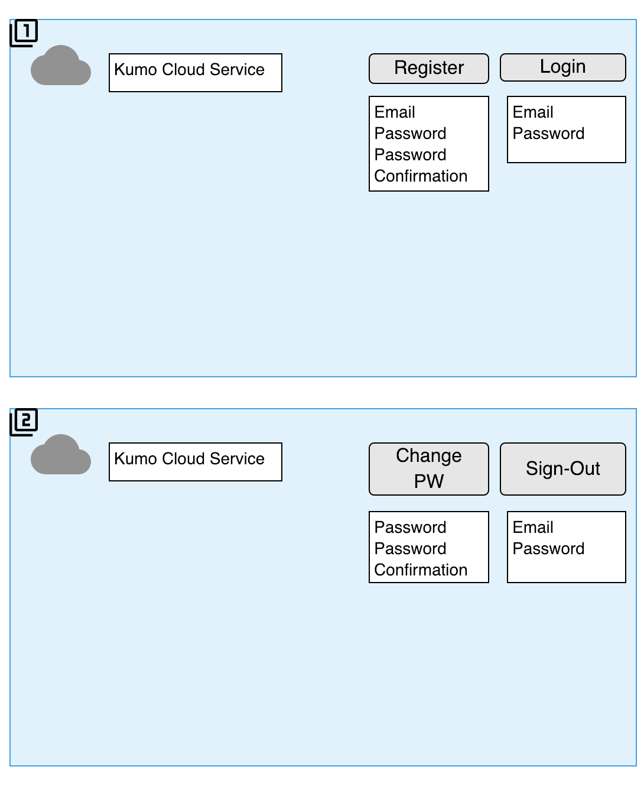
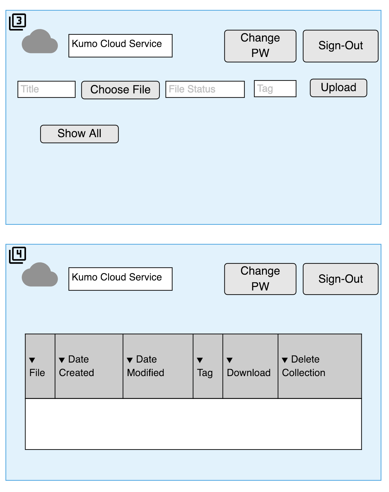

# Kumo-Front-End-Client
  Kumo (cloud in Japanese) is a secure cloud services platform that offers database storage, content delivery and other functionality to help users maintain files or collections online.

   Kumo prompts users to create an account for authentication purposes. Once logged in they can change their password and sign-out. The application works by allowing users to upload file(s) into its database. Once files are uploaded, they can also be updated & deleted; in addition users will be able to see all of the names of their files through integrated features.

## Links

* [Front-end repo](https://github.com/jooewoo/kumo-front-end-client)(Current Repo)
* [Back-end repo](https://github.com/jooewoo/kumo-back-end)
* [Kumo Application Deployed](https://jooewoo.github.io/kumo-front-end-client/)
* [Heroku Server](https://glacial-chamber-28137.herokuapp.com)

## Technologies Used

* HTML
* CSS/SASS
* Javascript
* JQuery
* Handlebars
* AJAX
* Bootstrap
* Express API
* Amazon Web Services
* MongoDB
* Mongoose

## Thought Process & Execution

* For the front-end of the application there were 3 main objectives;
  - 1. Create a simple yet user-friendly webpage using HTML & SASS.
  - 2. Use Forms and Buttons (with Handlebars) to allow the user initiate CRUD actions, which trigger AJAX calls to the API.
  - 3. Create visual feedback for users via JQuery calls in the UI file; this would allow the user to be aware of what was happening as they interacted with the web page.
* Initially appropiate repos for the front-end were hosted on GitHub and deployed.
* Followed by assigning classes and Ids to elements.
* Using Javascript as the main language, AJAX calls to the API would yield tokens to authenticate users.
* Once authenticated, its possible for users to perform CRUD actions on the files they wish to upload or maintain by
  communicating with the back-end.
* Users' authentication (token) would be destroyed once they decided to end their session or if the page refreshed/closed
  maintaining their resources protected.
* Kumo was deployed once fully operational with the API and database.

## User Stories

* As an unregistered user, I would like to sign up with email and password.

* As a registered user, I would like to sign in with email and password.

* As a signed in user, I would like to change password.

* As a signed in user, I would like to sign out.

* As a signed in user, I would like to upload a file to AWS.

* As a signed in user, I would like to update my file on AWS.

* As a signed in user, I would like to delete my file on AWS.

* As a signed in user, I would like to download files from AWS.

* As a signed in user, I would like to see the name of all files on AWS.

* As a signed in user, I would like to see the following meta-data for any file:

  - date created/uploaded
  - date modified
  - owner (user who uploaded the file)
  - tag

## Wireframes

## Unsolved Problems
* Modernize Styling
* Unable to download all file types/formats.

## Future Versions

* Below are some practical features to implement in future versions:
* Enable users to create "collaborators" which can be chosen; they have permission to read from and write to files.
* Allow users to generate file share links for other users.
* Implement a feature to make user owned files public.
* Introduce a "Write Once Read Many" (WORM) model along with an Object Lock feature that would allow file owners
  to protect their public files from being edited by other users.
* Add Server or Client side encryption in the app settings.
